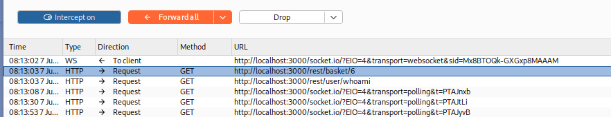
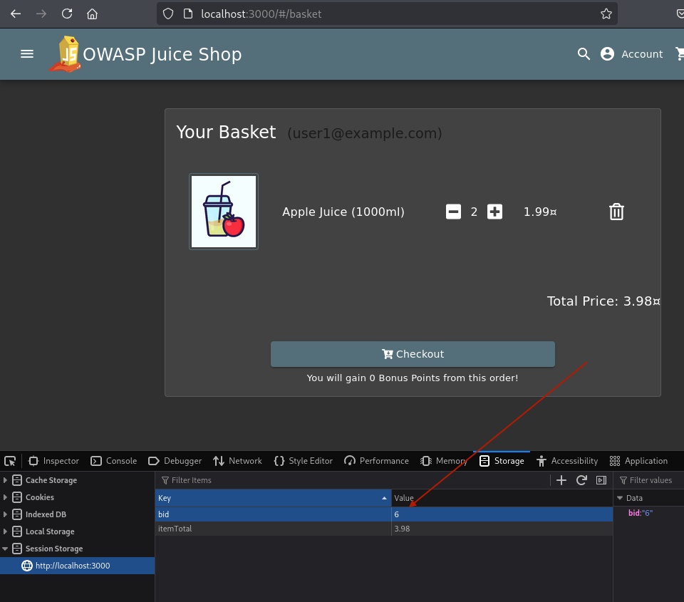
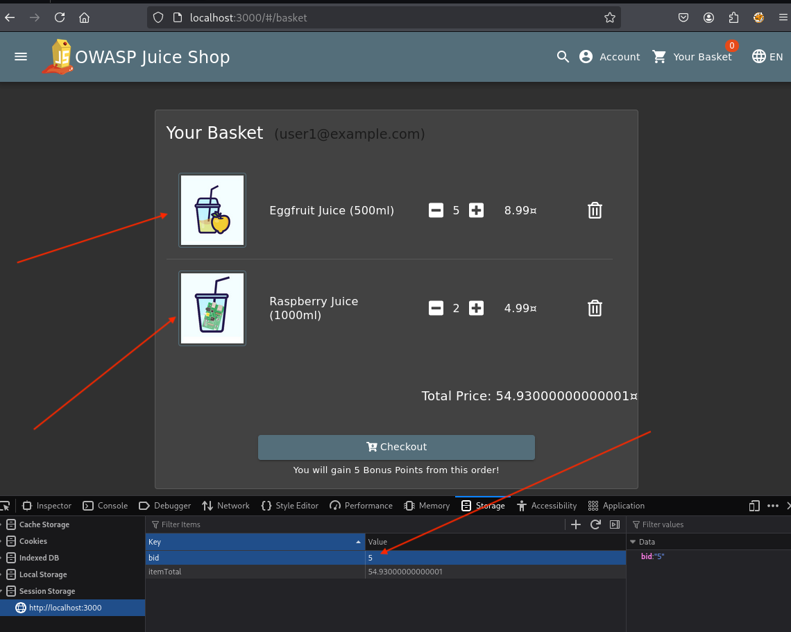

# A01:2021 - Broken Access Control

## Overview
[Broken Access Control](https://owasp.org/Top10/A01_2021-Broken_Access_Control/) is the top security catagory and occurs when restrictions on what authenticated users are allowed to do are not properly enforced. This can lead to unauthorized information disclosure, modification, or destruction of data, as well as performing business functions outside of the user's limits.

Access control enforces policy such that users cannot act outside of their intended permissions. Failures typically lead to unauthorized information disclosure, modification or destruction of all data, or performing a business function outside of the limits of the user.

## Reconnaissance
I was interested in the shopping basket. The url in the browser for a logged in user didn't have a basket ID. I expected there to be a `/basket/1234` in the url so that the web server knew what basket to look up. However, the path was just `/basket`. 

Running some requests through Burp, I saw that did infact know that the basket ID was. 

The question was, where was the browser getting that information? I couldn't find any requests to the server looking for the basket ID. That informatoin had to be stored locally on the client. Maybe in a cookie or in session storage?

Yes. It was session storage.

The `bid` ("basket ID?") is set to the same id as the api request.

Note: the user does have to be logged in.

### Exploit
Exploiting this vulnerability was a simple as changing `bid` in the session storage to another number and refresh the browser. 

The refreshed page shows a basket with items from another user. 

#### Classification
This vulnerability can be classified as:

**CWE-639: Authorization Bypass Through User-Controlled Key** - The application uses a user-controlled key (the `bid` value in session storage) to access restricted functionality without proper authorization checks.

**OWASP Top 10 2021: A01 - Broken Access Control** - Specifically falls under "Violation of the principle of least privilege or deny by default" and "Bypassing access control checks by modifying the URL, internal application state, or the HTML page."

**CVSS Base Score: High (7.5-8.9)** - This would likely receive a high severity rating due to the ease of exploitation and significant impact on confidentiality and integrity of user data.

**Attack Vector**: Client-side manipulation of session storage values
**Authentication Required**: Yes (user must be logged in)
**User Interaction**: None (once authenticated, exploitation is trivial)
**Scope**: Affects multiple users' data beyond the attacker's own account

### Impact
The impact of this broken access control vulnerability in an e-commerce application is severe and multifaceted:

**Data Privacy Breach**: Attackers can view other users' shopping baskets, revealing personal shopping preferences, purchase history, and potentially sensitive information about customers' needs or circumstances.

**Financial Impact**: Malicious users could modify other customers' baskets by adding expensive items, changing quantities, or removing items entirely, leading to incorrect orders and financial disputes.

**Business Reputation**: Customer trust would be severely damaged if users discover their private shopping data is accessible to others, potentially leading to customer churn and negative publicity.

**Compliance Violations**: This vulnerability likely violates data protection regulations such as GDPR, CCPA, or PCI DSS, potentially resulting in significant fines and legal consequences.

**Operational Disruption**: The business may need to halt operations, investigate the extent of the breach, notify affected customers, and implement emergency fixes, causing revenue loss and operational costs.

**Competitive Intelligence**: Competitors could potentially access customer shopping patterns and preferences, gaining unfair business intelligence about market demands and customer behavior.

### Remediation
Here are the reccomended security measures for remmediation:

#### Immediate Actions

**1. Server-Side Authorization Checks**
- Implement proper authorization validation on all basket-related API endpoints
- Verify that the authenticated user owns the requested basket before returning any data
- Never trust client-side data (session storage, cookies, or form parameters) for access control decisions

**2. Secure Session Management**
- Remove basket ID from client-side storage entirely
- Store basket associations server-side, linked to the authenticated user's session
- Use secure, server-generated session tokens that cannot be easily guessed or manipulated

**3. Database-Level Access Controls**
- Implement row-level security in the database to ensure users can only access their own basket data
- Add user ID foreign key constraints to basket tables
- Create database views that automatically filter results based on the authenticated user

#### Long-Term Security Improvements

**4. Implement Proper Access Control Framework**
- Deploy a centralized authorization system (e.g., RBAC or ABAC)
- Create consistent access control policies across all application endpoints
- Implement the principle of least privilege throughout the application

**5. Security Testing Integration**
- Add automated security tests to verify access control enforcement
- Implement integration tests that attempt unauthorized access to verify proper blocking
- Include access control testing in the CI/CD pipeline

**6. Monitoring and Logging**
- Log all access control violations and failed authorization attempts
- Implement real-time monitoring for suspicious access patterns
- Set up alerts for potential privilege escalation attempts

**7. Code Review and Security Training**
- Conduct thorough security code reviews focusing on authorization logic
- Provide security training to development teams on secure coding practices
- Establish secure development lifecycle (SDLC) processes
