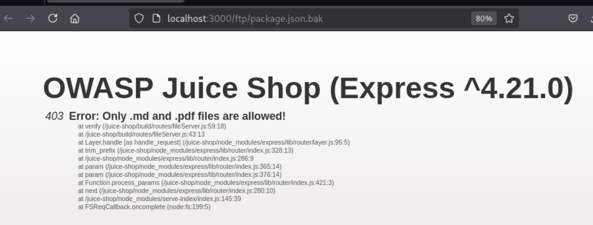
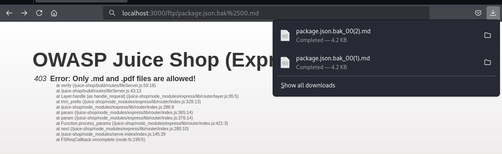

# A05:2021 Security Misconfiguration

## Overview
[Security Misconfiguration](https://owasp.org/Top10/A05_2021-Security_Misconfiguration/) occurs when security settings are not defined, implemented, and maintained properly. This vulnerability can happen at any level of an application stack, including network services, platforms, web servers, application servers, databases, frameworks, custom code, and pre-installed virtual machines, containers, or storage.

Security misconfigurations are commonly a result of insecure default configurations, incomplete or ad hoc configurations, open cloud storage, misconfigured HTTP headers, and verbose error messages containing sensitive information. Not only must all operating systems, frameworks, libraries, and applications be securely configured, but they must be patched and upgraded in a timely fashion.

**Common examples include:**
- Missing appropriate security hardening across any part of the application stack
- Improperly configured permissions on cloud services
- Unnecessary features enabled or installed (e.g., unnecessary ports, services, pages, accounts, or privileges)
- Default accounts and their passwords still enabled and unchanged
- Error handling reveals stack traces or other overly informative error messages to users
- Security settings in application servers, frameworks, libraries, databases, etc., are not set to secure values
- The server does not send security headers or directives, or they are not set to secure values

## Reconasissance
The previous exploit showed there was an `/ftp` endpoint with a list of files. [04 Insecure Design](./04-insecure-design.md) accessed the `aquisitions.md` file. See that walk through to learn how that endpoint was discovered and the results of that research. 

There were other files that could be of interested to an attacker. Clicking on the `package.json.bak` would be interesting since the `package.json` file holds all of the information about the packages used in the application. The application errors showing a stack trace and a version of the web server. 

However, this may be bypassed since it's saying that only `.md` and `.pdf` files are allows. The URL for the file is `/ftp/package.json.bak`. A Poison Null Byte may be enough for a bypass.

## Exploit
Adding `%2500.md` to the back of the url is enough to bypass the file format check since it's probably only checking to see if the reqeusted URL ends in `.md` or `.pdf`. The complete URL is `/ftp/package.json.bak%2500.md` since the poison byte bypasses the check. The `%25` is the URL-encoding for `%`. 

This allows us to download the `package.json` file.

## Impact
The impact of this security misconfiguration vulnerability is significant and demonstrates multiple layers of security control failures:

**Information Disclosure and Reconnaissance**: The ability to bypass file type restrictions and access the `package.json.bak` file provides attackers with detailed information about the application's technology stack, including all dependencies, their exact versions, development dependencies, and configuration details. This information serves as a roadmap for attackers to identify known vulnerabilities in specific package versions.

**Dependency Vulnerability Mapping**: With access to the complete package manifest, attackers can cross-reference each dependency and its version against known vulnerability databases (such as CVE databases, npm audit, or Snyk vulnerability database) to identify exploitable security flaws. This significantly reduces the time and effort required for attackers to find attack vectors.

**Technology Stack Fingerprinting**: The package.json file reveals the entire technology stack, including web frameworks, database drivers, authentication libraries, and utility packages. This information allows attackers to tailor their attacks to the specific technologies in use and leverage technology-specific vulnerabilities or misconfigurations.

**Attack Surface Expansion**: Knowledge of all installed packages, including development dependencies that may not be properly secured in production environments, expands the potential attack surface. Attackers can target less commonly secured development tools or utilities that may have been inadvertently exposed in production.

**Supply Chain Attack Preparation**: Understanding the application's dependency tree enables attackers to potentially compromise upstream packages or identify supply chain vulnerabilities. If any dependencies are sourced from compromised or malicious repositories, this information helps attackers understand the full scope of potential compromise.

**Version-Specific Exploit Development**: Knowing exact package versions allows attackers to develop or deploy version-specific exploits. Many security vulnerabilities are version-dependent, and having precise version information eliminates guesswork and enables targeted exploitation.

**Configuration and Secret Exposure**: Package.json files may contain configuration details, environment variable names, or even hardcoded secrets in scripts or configuration sections. This information can reveal additional attack vectors or sensitive information that should not be publicly accessible.

**Business Logic Understanding**: The dependencies and scripts defined in package.json can provide insights into the application's functionality, business logic, and architecture. This understanding helps attackers identify high-value targets and potential privilege escalation paths.

**Compliance and Regulatory Violations**: Exposing detailed technical information about the application stack may violate security policies, compliance requirements, or contractual obligations regarding information disclosure and system security.

**File System Access Control Bypass**: The successful use of poison null byte injection to bypass file type restrictions indicates broader file system access control weaknesses. This technique could potentially be used to access other sensitive files beyond package.json, including configuration files, source code, or database files.

**Defense Evasion**: The ability to bypass security controls using simple encoding techniques suggests that other security measures may be similarly vulnerable to evasion, indicating systemic security control implementation weaknesses.

**Competitive Intelligence**: For business applications, the technology stack information could provide competitors with insights into the organization's technical capabilities, development practices, and potential areas of technical debt or vulnerability.

**CVSS Base Score: Medium to High (5.0-7.5)** - The severity depends on the sensitivity of the exposed information and the presence of known vulnerabilities in the disclosed package versions. While this doesn't directly compromise the system, it significantly enhances an attacker's ability to identify and exploit other vulnerabilities.

**Attack Vector**: Network-based file access bypass
**Authentication Required**: None (publicly accessible endpoint)
**User Interaction**: None (attack can be fully automated)
**Scope**: Information disclosure affecting application security posture

This vulnerability represents a critical failure in both access control implementation and secure configuration practices, providing attackers with valuable intelligence for conducting more sophisticated and targeted attacks against the application.

## Classification
This vulnerability is classified as **A05:2021 - Security Misconfiguration** according to the OWASP Top 10 2021. The specific security misconfigurations demonstrated include:

**Primary Classification: A05:2021 - Security Misconfiguration**
- **File Type Validation Bypass**: Inadequate input validation allowing poison null byte injection to circumvent file extension restrictions
- **Insecure File Access Controls**: Publicly accessible FTP directory without proper access restrictions
- **Information Disclosure**: Exposure of sensitive application configuration files that should not be publicly accessible
- **Insufficient Security Hardening**: Lack of proper security controls on file serving endpoints

**Secondary Classifications:**
- **A01:2021 - Broken Access Control**: The ability to access restricted files through URL manipulation represents a failure in access control mechanisms
- **A03:2021 - Injection**: The poison null byte technique used to bypass file type restrictions is a form of injection attack exploiting improper input sanitization

**CWE Classifications:**
- **CWE-200: Exposure of Sensitive Information to an Unauthorized Actor**: Direct exposure of package.json containing sensitive technical information
- **CWE-22: Improper Limitation of a Pathname to a Restricted Directory ('Path Traversal')**: File access bypass through URL manipulation
- **CWE-158: Improper Neutralization of Null Byte or NUL Character**: Poison null byte injection vulnerability
- **CWE-16: Configuration**: Fundamental security misconfiguration in file serving implementation

**OWASP Testing Guide Categories:**
- **WSTG-CONF-05: Test File Extensions Handling for Sensitive Information**
- **WSTG-ATHZ-02: Test for Bypassing Authorization Schema**
- **WSTG-INPV-11: Test for File Inclusion**

This vulnerability exemplifies how multiple security misconfigurations can compound to create significant security risks, highlighting the importance of defense-in-depth security controls and proper security configuration management.

## Remediation
To remediate this security misconfiguration vulnerability and prevent unauthorized file access, implement the following comprehensive security measures:

### Immediate Actions

**1. Implement Proper Input Validation and Sanitization**
- Remove or properly handle null bytes (%00) in all user input before processing
- Implement strict whitelist-based file extension validation that cannot be bypassed
- Use secure file path validation libraries that handle encoding attacks
- Validate and sanitize all URL parameters before file system operations

**2. Restrict File Access Controls**
- Remove public access to the FTP directory and any sensitive configuration files
- Implement proper directory traversal protection to prevent path manipulation
- Use a dedicated static file serving mechanism with restricted file type access
- Configure web server to deny access to sensitive file types (.json, .config, .env, etc.)

**3. Secure File Serving Implementation**
- Implement a secure file serving endpoint that validates requested files against an allowlist
- Use indirect file references (IDs or tokens) instead of direct file paths in URLs
- Implement proper authentication and authorization for file access
- Log all file access attempts for security monitoring

### Long-term Security Improvements

**4. Web Server and Application Hardening**
- Configure web server security headers to prevent information disclosure
- Implement proper error handling that doesn't reveal system information
- Remove or secure development and debugging endpoints in production
- Configure web server to hide version information and server signatures

**5. File System Security**
- Move sensitive configuration files outside the web root directory
- Implement proper file permissions and access controls at the operating system level
- Use environment variables for sensitive configuration instead of files
- Encrypt sensitive configuration data at rest

**6. Security Configuration Management**
- Implement infrastructure as code with security configurations
- Use configuration management tools to ensure consistent security settings
- Regularly audit and review security configurations
- Implement automated security configuration scanning

### Application Security Controls

**7. Input Validation Framework**
- Implement a centralized input validation framework
- Use parameterized queries and prepared statements for all data access
- Implement proper encoding and escaping for all output
- Use security-focused validation libraries that handle edge cases

**8. Access Control Implementation**
- Implement role-based access control (RBAC) for all file operations
- Use principle of least privilege for file system access
- Implement proper session management and authentication
- Add authorization checks for all sensitive operations

**9. Security Monitoring and Logging**
- Implement comprehensive logging for all file access attempts
- Set up real-time monitoring for suspicious file access patterns
- Create alerts for potential path traversal or injection attempts
- Implement security information and event management (SIEM) integration

### Development and Deployment Practices

**10. Secure Development Lifecycle**
- Integrate security testing into the development pipeline
- Conduct regular security code reviews focusing on file handling
- Implement automated security scanning for configuration issues
- Use static analysis tools to detect path traversal vulnerabilities

**11. Security Testing**
- Perform regular penetration testing focusing on file access controls
- Implement automated security testing for input validation bypasses
- Test for various encoding and injection techniques
- Validate security controls in different deployment environments

**12. Incident Response Preparation**
- Develop incident response procedures for information disclosure events
- Create forensic logging capabilities for security investigations
- Implement automated response for detected security violations
- Establish communication procedures for security incidents

### Infrastructure Security

**13. Network Security Controls**
- Implement network segmentation to isolate file serving systems
- Use web application firewalls (WAF) to filter malicious requests
- Implement rate limiting to prevent automated attacks
- Configure intrusion detection and prevention systems

**14. Backup and Recovery**
- Implement secure backup procedures for configuration files
- Ensure backup systems don't expose sensitive information
- Test recovery procedures regularly
- Implement secure disposal of backup media

### Compliance and Governance

**15. Security Policies and Procedures**
- Establish clear policies for handling sensitive configuration information
- Implement change management procedures for security configurations
- Create security awareness training for development teams
- Establish regular security assessment schedules

**16. Vendor and Third-Party Management**
- Assess security configurations of third-party components
- Implement security requirements for external integrations
- Regularly update and patch all system components
- Monitor security advisories for used technologies

This comprehensive remediation approach addresses the root causes of the security misconfiguration while implementing defense-in-depth controls to prevent similar vulnerabilities and protect sensitive information from unauthorized access.
