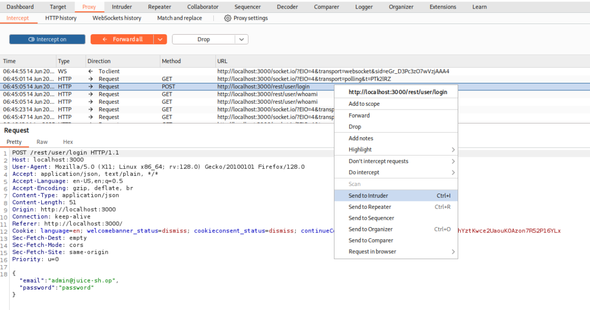
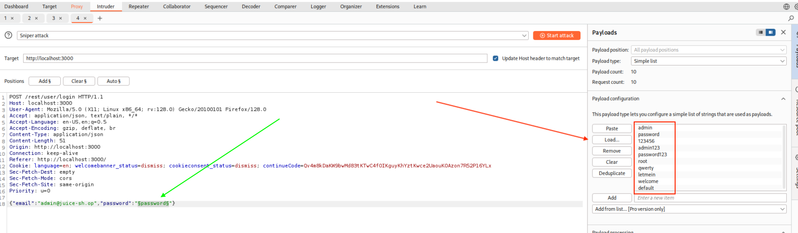
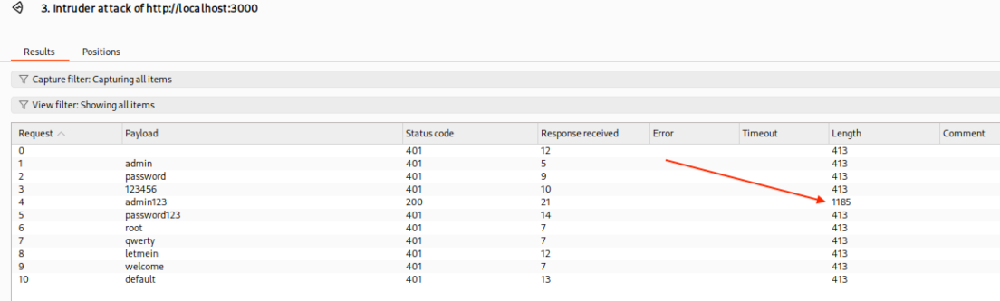
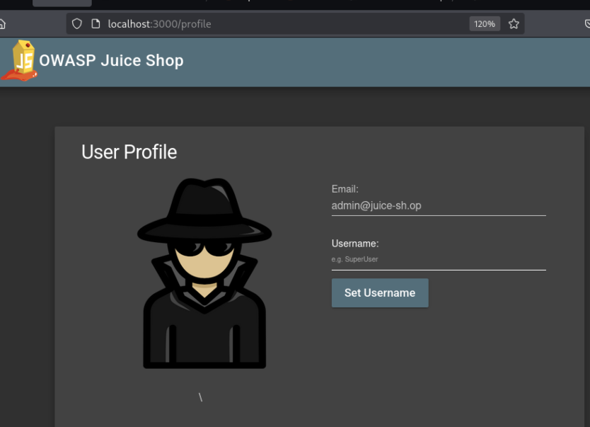

# A7: 2021 - Idenfitication and Authorization Errors

## Overview
[Identification and Authorization Failures](https://owasp.org/Top10/A07_2021-Identification_and_Authorization_Failures/) occur when applications fail to properly confirm user identity, authenticate users, or authorize access to resources. This vulnerability category encompasses weaknesses in session management, authentication mechanisms, and access controls that can allow attackers to compromise passwords, keys, or session tokens, or exploit other implementation flaws to assume other users' identities temporarily or permanently.

Identification and authorization failures can lead to unauthorized access to sensitive data, privilege escalation, account takeover, and complete system compromise. These failures often result from weak authentication mechanisms, improper session management, predictable session identifiers, or missing authorization checks.

**Common examples include:**
- Permits automated attacks such as credential stuffing, where the attacker has a list of valid usernames and passwords
- Permits brute force or other automated attacks
- Permits default, weak, or well-known passwords, such as "Password1" or "admin/admin"
- Uses weak or ineffective credential recovery and forgot-password processes
- Uses plain text, encrypted, or weakly hashed passwords
- Has missing or ineffective multi-factor authentication
- Exposes session identifier in the URL
- Reuses session identifier after successful login
- Does not properly invalidate session IDs during logout or a period of inactivity
- Missing access controls or authorization checks for authenticated functionality

## Reconasissance

The site has a login form at `/login` that could be a great place to do a bruteforce attack. Through some open source recon, it was discovered that admins of the site have the email `juice-sh.op` domains. Now it's time to bruceforce `admin@juice-sh.op` with common passwords.

## Exploit
The exploit begins with setting Burp to Proxy mode and catching the web `POST` request for the login and send it to Intruder. This captures the full request headers and body to be bruteforced.

Highlighting the `password` field and clicking *Add* adds the variables symbols to tell Burp this is field that gets brutefoced (green arrow). Everything else remains the same. Loading a common password wordslist is what Intruder will loop over (red arrow and box). 

Time to start the attack.

Intruder loops over that wordlist (a short one for the demo) and tries the request for each item in the list. Checking the response length shows that one request is different than the rest. It's for password `admin123`. 

Clicking on that result and the *Response* tab shows the full successful response. Intruder received a `200 OK` from the server with a token for `admin@juice-sh.op`. Let's try to login with that user and password.

Logging in as admin using the bruteforced password was successful.

### Classification
This vulnerability can be classified as:

**CWE-307: Improper Restriction of Excessive Authentication Attempts** - The application does not implement proper controls to prevent or limit the number of authentication attempts, allowing attackers to perform brute force attacks against user credentials.

**CWE-521: Weak Password Requirements** - The application allows users to set weak passwords (like "admin123") that can be easily guessed or cracked through automated attacks.

**OWASP Top 10 2021: A07 - Identification and Authorization Failures** - Specifically falls under "Permits automated attacks such as credential stuffing" and "Permits default, weak, or well-known passwords."

**CVSS Base Score: High (7.5-8.9)** - This would likely receive a high severity rating due to the administrative access gained and the ease of exploitation through automated tools.

**Attack Vector**: Network-based brute force attack
**Authentication Required**: None (the attack targets the authentication mechanism itself)
**User Interaction**: None (fully automated attack)
**Scope**: Administrative account compromise with elevated privileges

## Impact
The impact of this identification and authorization failure vulnerability is severe and multifaceted, stemming from both weak password policies and the absence of brute force protection:

**Administrative Account Compromise**: The successful brute force attack against the admin account provides attackers with the highest level of system access, potentially allowing them to view, modify, or delete any data within the application, access administrative functions, and compromise the entire system.

**Weak Password Policy Exploitation**: The use of easily guessable passwords like "admin123" demonstrates inadequate password complexity requirements, making accounts vulnerable to dictionary attacks and common password lists that can be executed rapidly with automated tools.

**Lack of Rate Limiting**: The absence of authentication attempt restrictions allows attackers to perform unlimited login attempts without detection or blocking, making brute force attacks trivial to execute and significantly increasing the likelihood of success.

**Business Operations Disruption**: With administrative access, attackers could manipulate critical business data, alter product information, modify pricing, access customer databases, or completely shut down the e-commerce platform, leading to significant revenue loss and operational disruption.

**Data Breach and Privacy Violations**: Administrative access typically includes access to all customer data, payment information, personal details, and business intelligence, potentially resulting in massive data breaches that violate privacy regulations like GDPR, CCPA, and PCI DSS.

**Reputational Damage**: A successful attack on an administrative account, especially one compromised through such basic security failures, would severely damage customer trust and brand reputation, potentially leading to long-term customer loss and negative publicity.

**Compliance and Legal Consequences**: The combination of weak passwords and lack of brute force protection likely violates multiple security compliance frameworks and regulations, potentially resulting in significant fines, legal action, and mandatory security audits.

**Lateral Movement and Privilege Escalation**: Once inside with administrative privileges, attackers can use this foothold to explore internal systems, access additional resources, and potentially compromise other connected systems or services within the organization's infrastructure.

**Account Takeover Chain Reaction**: The successful compromise demonstrates systemic security weaknesses that likely affect other user accounts, potentially enabling widespread account takeovers across the entire user base through similar brute force techniques.

## Conclusion