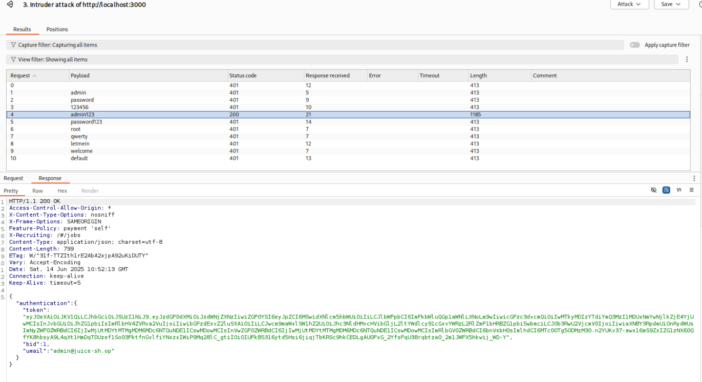

# A7: 2021 - Idenfitication and Authorization Errors

## Overview
[Identification and Authorization Failures](https://owasp.org/Top10/A07_2021-Identification_and_Authorization_Failures/) occur when applications fail to properly confirm user identity, authenticate users, or authorize access to resources. This vulnerability category encompasses weaknesses in session management, authentication mechanisms, and access controls that can allow attackers to compromise passwords, keys, or session tokens, or exploit other implementation flaws to assume other users' identities temporarily or permanently.

Identification and authorization failures can lead to unauthorized access to sensitive data, privilege escalation, account takeover, and complete system compromise. These failures often result from weak authentication mechanisms, improper session management, predictable session identifiers, or missing authorization checks.

**Common examples include:**
- Permits automated attacks such as credential stuffing, where the attacker has a list of valid usernames and passwords
- Permits brute force or other automated attacks
- Permits default, weak, or well-known passwords, such as "Password1" or "admin/admin"
- Uses weak or ineffective credential recovery and forgot-password processes
- Uses plain text, encrypted, or weakly hashed passwords
- Has missing or ineffective multi-factor authentication
- Exposes session identifier in the URL
- Reuses session identifier after successful login
- Does not properly invalidate session IDs during logout or a period of inactivity
- Missing access controls or authorization checks for authenticated functionality

## Reconaissance
BurpSuite Proxy captured the request to the `/rest/user/login` endpoint when attempting to login. It may be vulnerable to a bruteforce attack. 

## Exploit
Send the intercepted `POST` request for logging in to Intruder.

Add the `password` field to the Intruder since this will be what gets changed on every attack. Loaded a custom wordlist with common passwords.

Next, hit `Start Attack` for Intruder to loop over the list and try every combination of username and password in the list.

Intruder shows a list of all the attacks. At a glance, there are different response lengths. The one that stands out may be the successful attack. 

Opening up the response shows a successful login with password `admin123`. Naviate back to the app and login.

We are now logged in as admin after bruteforcing credentails.

## Impact
The impact of this identification and authorization failure vulnerability is severe and demonstrates critical weaknesses in authentication security controls:

**Administrative Account Compromise**: Successfully brute-forcing the administrator account provides attackers with the highest level of system access, enabling them to perform any administrative function including user management, system configuration changes, data manipulation, and complete system control.

**Complete System Takeover**: With administrative privileges, attackers can modify system settings, install malicious software, create backdoor accounts, disable security controls, and maintain persistent access to the compromised system. This level of access effectively gives attackers complete control over the application and potentially the underlying infrastructure.

**Data Breach and Exfiltration**: Administrative access typically includes unrestricted access to all user data, sensitive business information, financial records, personal identifiable information (PII), and confidential documents. Attackers can exfiltrate this data for financial gain, competitive advantage, or malicious purposes.

**User Account Manipulation**: Administrators can typically create, modify, or delete user accounts, reset passwords, and change user permissions. This allows attackers to create additional administrative accounts for persistence, escalate privileges of existing accounts, or lock out legitimate users to maintain exclusive access.

**Business Disruption and Denial of Service**: Administrative access enables attackers to disrupt business operations by modifying critical configurations, deleting important data, disabling services, or corrupting system functionality. This can result in significant downtime, lost revenue, and operational chaos.

**Compliance and Regulatory Violations**: Unauthorized access to administrative functions and sensitive data likely violates numerous regulatory requirements such as GDPR, HIPAA, PCI DSS, and SOX. This can result in substantial fines, legal consequences, and mandatory breach notifications that damage organizational reputation.

**Audit Trail Manipulation**: Administrators often have the ability to modify or delete audit logs and security monitoring data. Attackers can use this access to cover their tracks, delete evidence of their activities, and make forensic investigation significantly more difficult.

**Lateral Movement and Network Compromise**: Administrative access to the web application can serve as a launching point for attacks against other systems in the network. Attackers may be able to access internal networks, databases, file servers, and other critical infrastructure components.

**Supply Chain and Third-Party Impact**: If the compromised application integrates with partner systems, vendors, or customers, the administrative access could be leveraged to attack these external entities, potentially causing widespread damage beyond the immediate organization.

**Financial Fraud and Theft**: Depending on the application's functionality, administrative access might enable direct financial fraud, unauthorized transactions, manipulation of financial records, or theft of payment information and financial assets.

**Reputation and Trust Damage**: A successful administrative account compromise, especially one achieved through such a basic attack as password brute-forcing, demonstrates fundamental security failures that can severely damage customer trust, partner relationships, and market reputation.

**Long-term Persistence**: Administrative access allows attackers to establish multiple persistence mechanisms, making it extremely difficult to completely remove their access even after the initial vulnerability is discovered and patched.

**Weak Authentication Controls**: The successful brute-force attack indicates the absence of basic security controls such as account lockout policies, rate limiting, CAPTCHA implementation, or multi-factor authentication, suggesting systemic security weaknesses that may affect other parts of the application.

**CVSS Base Score: Critical (9.0-10.0)** - This vulnerability represents a complete compromise of the application's security with maximum impact on confidentiality, integrity, and availability.

**Attack Vector**: Network-based brute force attack
**Authentication Required**: None (attack bypasses authentication)
**User Interaction**: None (attack can be fully automated)
**Scope**: Complete system compromise with administrative privileges

## Classification
This vulnerability is classified as **A07:2021 - Identification and Authentication Failures** for several key reasons:

**Primary Classification:**
- **Weak Password Policy**: The administrative account uses a predictable, weak password ("admin123") that can be easily guessed through brute force attacks
- **Insufficient Brute Force Protection**: The application lacks proper controls to prevent or detect automated password guessing attacks
- **Missing Account Lockout**: No account lockout mechanism is implemented to temporarily disable accounts after multiple failed login attempts
- **Absence of Rate Limiting**: The application doesn't implement rate limiting to slow down or block rapid authentication attempts

**Secondary Classifications:**
This vulnerability also exhibits characteristics of:
- **A01:2021 - Broken Access Control**: Once authentication is bypassed, the attacker gains unauthorized administrative access
- **A09:2021 - Security Logging and Monitoring Failures**: The system may not adequately log or alert on suspicious authentication patterns

**Why This is Primarily A07:**
The core issue is the failure of authentication mechanisms to properly verify user identity and prevent unauthorized access. The OWASP Top 10 specifically identifies identification and authentication failures as including scenarios where:
- Applications permit automated attacks such as credential stuffing or brute force attacks
- Applications permit default, weak, or well-known passwords
- Applications use weak or ineffective credential recovery and forgot-password processes
- Applications lack multi-factor authentication (MFA)

**CWE Classifications:**
- **CWE-307**: Improper Restriction of Excessive Authentication Attempts
- **CWE-521**: Weak Password Requirements
- **CWE-798**: Use of Hard-coded Credentials (if admin123 is a default password)
- **CWE-287**: Improper Authentication

**NIST Cybersecurity Framework Mapping:**
- **PR.AC-1**: Identities and credentials are issued, managed, verified, revoked, and audited for authorized devices, users and processes
- **PR.AC-7**: Users, devices, and other assets are authenticated (e.g., single-factor, multi-factor) commensurate with the risk of the transaction
- **DE.CM-1**: The network is monitored to detect potential cybersecurity events

## Remediations
To effectively remediate this identification and authentication failure vulnerability, organizations should implement a comprehensive set of security controls and best practices:

### Immediate Remediation Actions

**1. Password Policy Enforcement**
- Implement strong password requirements with minimum length (12+ characters), complexity requirements, and character diversity
- Prohibit common passwords, dictionary words, and predictable patterns
- Require regular password changes for administrative accounts (90-180 days)
- Implement password history to prevent reuse of recent passwords

**2. Account Lockout and Rate Limiting**
- Configure account lockout after 3-5 failed login attempts
- Implement progressive delays between login attempts (exponential backoff)
- Set appropriate lockout duration (15-30 minutes) with administrative unlock capability
- Apply rate limiting at both application and network levels

**3. Multi-Factor Authentication (MFA)**
- Mandate MFA for all administrative accounts and privileged users
- Implement time-based one-time passwords (TOTP), SMS, or hardware tokens
- Consider risk-based authentication that requires additional factors for suspicious activities
- Provide backup authentication methods for account recovery

**4. Session Management**
- Implement secure session timeout policies (15-30 minutes for administrative sessions)
- Use secure session tokens with sufficient entropy and proper rotation
- Implement concurrent session limits for administrative accounts
- Ensure proper session invalidation on logout and password changes

### Enhanced Security Controls

**5. Monitoring and Alerting**
- Implement real-time monitoring for failed authentication attempts
- Set up automated alerts for suspicious login patterns or brute force attempts
- Log all authentication events with sufficient detail for forensic analysis
- Integrate with Security Information and Event Management (SIEM) systems

**6. Network-Level Protection**
- Implement IP-based access restrictions for administrative interfaces
- Use Web Application Firewalls (WAF) to detect and block brute force attacks
- Consider geographic restrictions for administrative access
- Implement network segmentation to isolate administrative interfaces

**7. CAPTCHA and Human Verification**
- Implement CAPTCHA after initial failed login attempts
- Use progressive CAPTCHA complexity based on risk assessment
- Consider behavioral analysis to distinguish human from automated attempts
- Implement device fingerprinting for additional verification

### Long-term Security Improvements

**8. Privileged Access Management (PAM)**
- Implement dedicated PAM solutions for administrative account management
- Use just-in-time (JIT) access provisioning for administrative privileges
- Implement approval workflows for administrative access requests
- Maintain detailed audit trails of all privileged activities

**9. Identity and Access Management (IAM)**
- Centralize authentication through enterprise identity providers
- Implement Single Sign-On (SSO) with strong authentication requirements
- Use directory services (Active Directory, LDAP) for centralized user management
- Implement role-based access control (RBAC) with principle of least privilege

**10. Security Awareness and Training**
- Conduct regular security awareness training for administrators
- Implement phishing simulation and social engineering awareness programs
- Establish clear security policies and procedures for password management
- Provide training on recognizing and reporting security incidents

### Technical Implementation Guidelines

**11. Secure Development Practices**
- Implement secure coding standards for authentication mechanisms
- Use established authentication libraries and frameworks rather than custom implementations
- Conduct regular security code reviews focusing on authentication logic
- Implement automated security testing in the development pipeline

**12. Vulnerability Management**
- Conduct regular penetration testing focusing on authentication mechanisms
- Implement automated vulnerability scanning for authentication-related weaknesses
- Establish a responsible disclosure program for security researchers
- Maintain an inventory of all authentication endpoints and mechanisms

**13. Incident Response Planning**
- Develop specific incident response procedures for authentication failures
- Establish communication protocols for suspected account compromises
- Implement automated response capabilities for detected brute force attacks
- Conduct regular tabletop exercises for authentication-related incidents

### Compliance and Governance

**14. Regulatory Compliance**
- Ensure authentication controls meet relevant regulatory requirements (SOX, PCI-DSS, HIPAA)
- Implement audit trails sufficient for compliance reporting
- Conduct regular compliance assessments of authentication mechanisms
- Maintain documentation of security controls and their effectiveness

**15. Risk Assessment and Management**
- Conduct regular risk assessments of authentication mechanisms
- Implement risk-based authentication policies
- Establish metrics for measuring authentication security effectiveness
- Review and update authentication policies based on threat landscape changes

### Monitoring and Continuous Improvement

**16. Security Metrics and KPIs**
- Track failed authentication attempt rates and patterns
- Monitor account lockout frequency and duration
- Measure MFA adoption rates and effectiveness
- Analyze authentication-related security incidents and trends

**17. Continuous Security Testing**
- Implement automated testing for authentication bypass vulnerabilities
- Conduct regular brute force testing against authentication mechanisms
- Perform social engineering assessments targeting authentication processes
- Test incident response procedures for authentication-related events

By implementing these comprehensive remediation measures, organizations can significantly strengthen their authentication mechanisms and protect against brute force attacks and other identification and authentication failures. The key is to implement defense-in-depth strategies that combine technical controls, process improvements, and user education to create a robust security posture.
