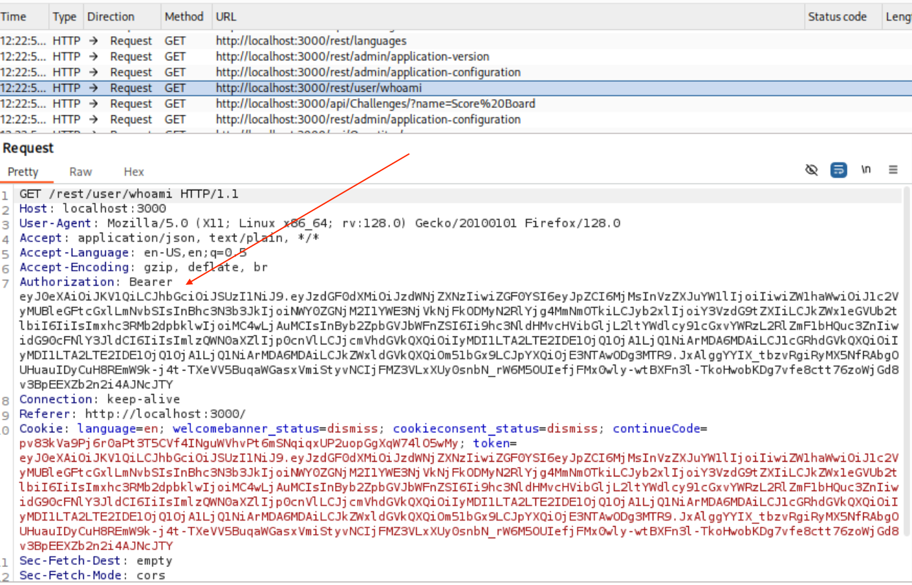
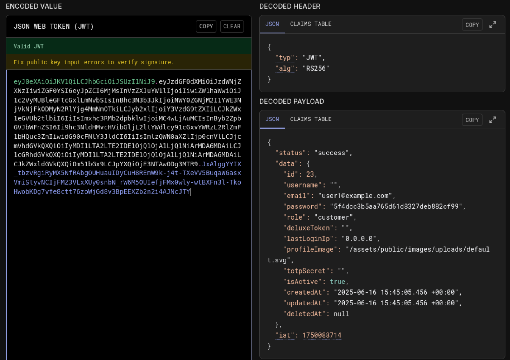
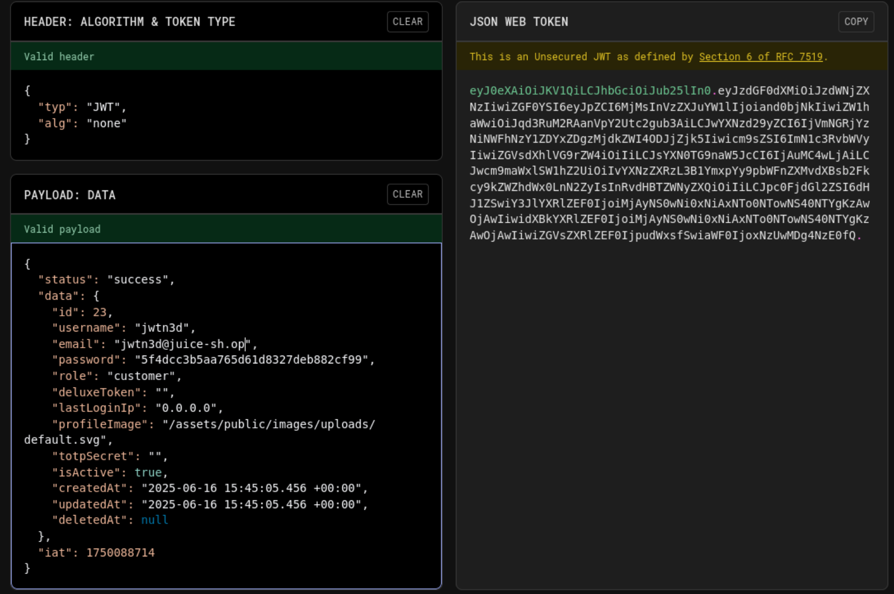
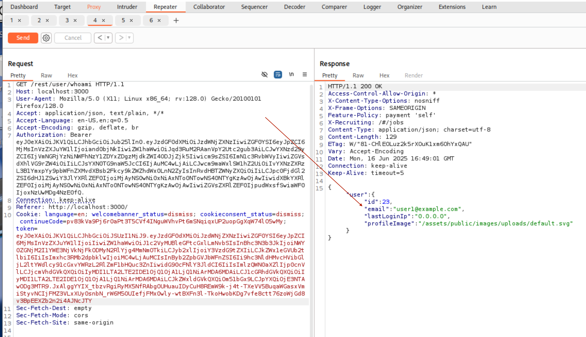
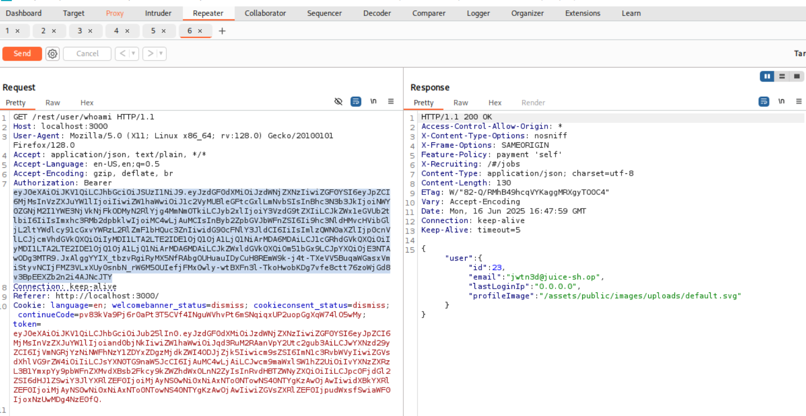

# A8:2021 - Software and Data Integrity Failures

## Overview
[Software and Data Integrity Failures](https://owasp.org/Top10/A08_2021-Software_and_Data_Integrity_Failures/) relate to code and infrastructure that does not protect against integrity violations. This occurs when applications rely on plugins, libraries, or modules from untrusted sources, repositories, and content delivery networks (CDNs), or when an insecure CI/CD pipeline introduces the potential for unauthorized access, malicious code, or system compromise.

Software and data integrity failures can lead to unauthorized code execution, data tampering, supply chain attacks, and complete system compromise. These failures often result from insufficient verification of software integrity, lack of code signing, insecure update mechanisms, or compromised build and deployment processes.

**Common examples include:**
- Applications that rely upon plugins, libraries, or modules from untrusted sources, repositories, and content delivery networks (CDNs)
- An insecure CI/CD pipeline can introduce the potential for unauthorized access, malicious code, or system compromise
- Auto-update functionality, where updates are downloaded without sufficient integrity verification and applied to the previously trusted application
- Objects or data are encoded or serialized into a structure that an attacker can see and modify is vulnerable to insecure deserialization
- The application relies upon plugins, libraries, or modules from untrusted sources, repositories, and content delivery networks (CDNs)

## Reconnaissance
Normal using the site and watching the Burp Proxy showed calls to a `/rest/user/whoami` endpoint. Inspecting the request shows an `Authorization` header. 

That `Authorization` header has a jwt. Let's check it out in [jwt.io](https://jwt.io).

This looks like a typical JWT with one thing that's interesting. jwt.io is saying there's an error with the public key that signed this. Maybe we can forge the JWT if signing is bypassed.

## Exploit
From the recon phase, there's a user called `jwtn3d`. Let's try to impersonate them. 

Go to the `Encoder` section of jwt.io and update the *header.alg* to be `none` (sign public key verification may not be present), *data.username* to be `jwtn3d`, and *data.email* to be `jwtn3d@juice-sh.op`.

jwt.io will create a new token. 

Send the `whoami` request to Repeater. Trying the endpoint again show's who we are, `user1@example.com`.

Now, let's paste in the forged JWT into the `token=` cookie.

The endpoint now returns that we are another user. 

### Impact
The impact of this software and data integrity failure vulnerability is significant and demonstrates critical weaknesses in authentication and authorization mechanisms:

**Identity Impersonation and Account Takeover**: The ability to forge JWT tokens with the algorithm set to "none" allows attackers to impersonate any user in the system by simply modifying the username and email fields in the token payload. This completely bypasses authentication controls and enables full account takeover without knowing user credentials.

**Authentication Bypass**: The vulnerability demonstrates a complete failure of the JWT signature verification process. By setting the algorithm to "none," the application accepts unsigned tokens as valid, effectively disabling the cryptographic integrity protection that JWTs are designed to provide.

**Privilege Escalation**: Attackers can potentially escalate their privileges by forging tokens for administrative users or users with elevated permissions. This could lead to unauthorized access to sensitive administrative functions, user management capabilities, and system configuration options.

**Data Access and Manipulation**: With the ability to impersonate any user, attackers can access personal information, transaction history, private messages, and other sensitive data belonging to legitimate users. They can also modify user profiles, make unauthorized transactions, or perform actions on behalf of other users.

**Session Management Compromise**: The vulnerability undermines the entire session management system, as the application cannot reliably determine user identity. This affects all security controls that depend on proper user identification, including access controls, audit logging, and user-specific data protection.

**Compliance and Regulatory Violations**: The ability to access other users' data without authorization likely violates numerous privacy regulations such as GDPR, CCPA, and HIPAA (if applicable), potentially resulting in significant fines and legal consequences.

**Business Logic Bypass**: Attackers can circumvent business rules and restrictions by impersonating users with different permissions or account statuses. This could include bypassing purchase limits, accessing premium features without payment, or manipulating user-specific business processes.

**Audit Trail Corruption**: Actions performed using forged tokens will be logged under the impersonated user's identity, making it difficult to trace malicious activities back to the actual attacker and potentially implicating innocent users in fraudulent activities.

**Trust and Reputation Damage**: Users discovering that their accounts can be easily impersonated will lose confidence in the platform's security, leading to customer churn and significant reputational damage that could affect long-term business viability.

**Supply Chain Security Implications**: This vulnerability highlights broader software integrity issues, suggesting that the development team may not be following secure coding practices or properly validating third-party libraries and dependencies used in the authentication system.

#### Classification
This vulnerability can be classified as:

**CWE-347: Improper Verification of Cryptographic Signature** - The application fails to properly verify JWT signatures, accepting tokens with the algorithm set to "none" which bypasses cryptographic validation entirely.

**CWE-287: Improper Authentication** - The authentication mechanism can be completely bypassed by forging JWT tokens, allowing attackers to impersonate any user without valid credentials.

**CWE-345: Insufficient Verification of Data Authenticity** - The application does not adequately verify the authenticity of JWT tokens, accepting manipulated tokens as legitimate authentication credentials.

**OWASP Top 10 2021: A08 - Software and Data Integrity Failures** - Specifically falls under "Software and data integrity failures relate to code and infrastructure that does not protect against integrity violations" and demonstrates inadequate verification of cryptographically signed data.

**CVSS Base Score: Critical (9.0-10.0)** - This would likely receive a critical severity rating due to the complete authentication bypass, ability to impersonate any user, and potential for widespread account takeover with minimal technical skill required.

**Attack Vector**: Network-based token manipulation
**Authentication Required**: Initial valid token (which can then be modified)
**User Interaction**: None (attack can be fully automated)
**Scope**: Complete authentication system compromise affecting all users

**JWT Security Best Practices Violation**: This vulnerability violates fundamental JWT security principles by accepting unsigned tokens and failing to implement proper algorithm verification, representing a critical failure in secure token implementation.

## Remeditation
To remediate this critical JWT vulnerability and prevent software and data integrity failures, implement the following security measures:

### Immediate Actions

**1. Enforce Algorithm Verification**
- Never accept JWT tokens with the algorithm set to "none"
- Implement strict algorithm whitelisting that only allows approved signing algorithms (e.g., HS256, RS256)
- Reject any token that doesn't use an expected algorithm

**2. Implement Proper JWT Signature Verification**
- Always verify JWT signatures using the appropriate secret key or public key
- Use established JWT libraries that handle signature verification correctly
- Never skip signature verification in any environment, including development

**3. Validate Token Structure and Claims**
- Verify all required claims are present (iss, aud, exp, iat)
- Implement proper token expiration checking
- Validate issuer and audience claims match expected values
- Check token timestamps to prevent replay attacks

### Long-term Security Improvements

**4. Implement Secure Key Management**
- Use strong, randomly generated secret keys for HMAC algorithms
- Implement proper key rotation policies
- Store signing keys securely using environment variables or key management systems
- Use asymmetric algorithms (RS256) for better key separation between signing and verification

**5. Add Additional Security Layers**
- Implement token blacklisting for logout functionality
- Add rate limiting to prevent token brute force attacks
- Use short token expiration times with refresh token mechanisms
- Implement proper session management alongside JWT tokens

**6. Code Review and Testing**
- Conduct security code reviews focusing on authentication mechanisms
- Implement automated security testing for JWT handling
- Use static analysis tools to detect JWT security vulnerabilities
- Perform regular penetration testing of authentication systems
