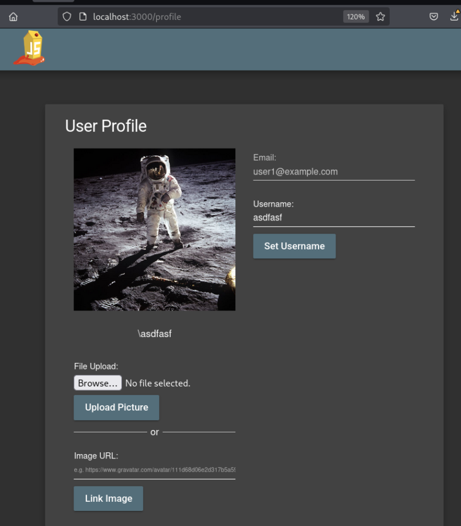
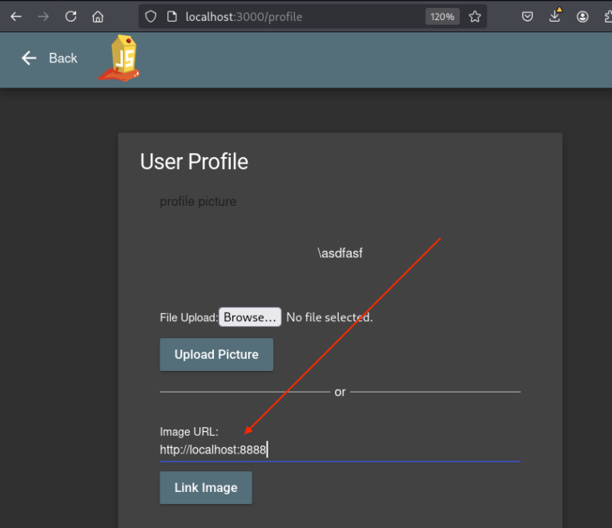

# A10:2021 - Server-Side Request Forgery (SSRF)

## Overview
[Server-Side Request Forgery (SSRF)](https://owasp.org/Top10/A10_2021-Server-Side_Request_Forgery_%28SSRF%29/) flaws occur whenever a web application is fetching a remote resource without validating the user-supplied URL. It allows an attacker to coerce the application to send a crafted request to an unexpected destination, even when protected by a firewall, VPN, or another type of network access control list (ACL).

SSRF vulnerabilities can allow attackers to access internal systems, services, and data that are not directly accessible from the internet. These attacks can lead to unauthorized access to internal services, data exfiltration, port scanning of internal networks, and in some cases, remote code execution on internal systems.

**Common examples include:**
- Applications that fetch remote resources without validating user-supplied URLs
- Applications that allow users to import data from URLs without proper validation
- Webhook functionality that doesn't validate callback URLs
- PDF generators that fetch remote resources based on user input
- Image processing services that fetch images from user-provided URLs
- Applications that proxy requests to third-party services without proper validation

## Reconnaissance
Navigating the site and the typical user flows showed a form that took in a URL for a Gravatar as showned by the placeholder text in the form field. Testing showed it would not error passing in any number of URLs that weren't `gravatar.com` since the below image is from [Pexels](https://images.pexels.com/photos/41162/moon-landing-apollo-11-nasa-buzz-aldrin-41162.jpeg?auto=compress&cs=tinysrgb&w=1260&h=750&dpr=1).



Error handling maynot be property configured or this could be the perfect opportunity for a SSRF. Time to exploit it and find out.

## Exploit
Exploiting this vulnerability will require setting up a listener to see if truly will make requests any arbitrary URL.

First step is to set up a listener. The [http](https://pypi.org/project/http/) package in Python has a builtin webserver to use. Setting it up is a single command.

```sh
python3 -m http.server 8888
Serving HTTP on 0.0.0.0 port 8888 (http://0.0.0.0:8888/) ...
```
The http server is running on localhost and listening on port *8888*. Web requests to this server will be logged to standard out. Now, let's make the request.



Immdiately after clicking the `Link Image` button, a web request has been logged to the listening http server.

```sh
python3 -m http.server 8888
Serving HTTP on 0.0.0.0 port 8888 (http://0.0.0.0:8888/) ...
127.0.0.1 - - [14/Jun/2025 06:09:32] "GET / HTTP/1.1" 200 -
```

This shows arbitrary SSRF including to localhost.

### Impact
The impact of an arbitrary Server-Side Request Forgery (SSRF) vulnerability is severe and can lead to significant security compromises:

**Internal Network Access**: Attackers can use the vulnerable application as a proxy to access internal systems, services, and resources that are normally protected by firewalls or network segmentation. This includes internal web applications, databases, configuration servers, and administrative interfaces.

**Cloud Metadata Service Exploitation**: In cloud environments (AWS, Azure, GCP), attackers can access metadata services (e.g., http://169.254.169.254/) to retrieve sensitive information such as API keys, access tokens, instance credentials, and configuration data that can lead to complete cloud account compromise.

**Port Scanning and Network Reconnaissance**: The vulnerability allows attackers to perform port scanning and network enumeration of internal infrastructure, mapping out internal network topology, identifying running services, and discovering potential attack vectors that would otherwise be invisible from external networks.

**Data Exfiltration**: Attackers can retrieve sensitive data from internal systems, including configuration files, database contents, source code repositories, and other confidential information stored on internal servers or file shares.

**Denial of Service (DoS)**: Malicious requests can be crafted to overwhelm internal services, consume server resources, or cause application crashes, leading to service disruption and availability issues.

**Bypass Security Controls**: SSRF can be used to bypass IP-based access controls, firewalls, and network ACLs since requests originate from the trusted application server rather than the attacker's external IP address.

**Credential Harvesting**: Access to internal authentication systems, LDAP servers, or credential stores can lead to the compromise of user accounts and service credentials, enabling lateral movement within the organization.

**Remote Code Execution**: In some cases, SSRF can be chained with other vulnerabilities to achieve remote code execution on internal systems, particularly when targeting services with known vulnerabilities or weak authentication mechanisms.

#### Classification
This vulnerability can be classified as:

**CWE-918: Server-Side Request Forgery (SSRF)** - The application accepts a URL or similar request from the user and retrieves the contents of this URL, but it does not sufficiently ensure that the request is being sent to the expected destination.

**OWASP Top 10 2021: A10 - Server-Side Request Forgery (SSRF)** - Direct classification under this category as the application makes requests to arbitrary URLs provided by user input without proper validation or restrictions.

**CVSS Base Score: High (8.6)** - This receives a high severity rating due to:
- **Attack Vector: Network** - Exploitable remotely over the network
- **Attack Complexity: Low** - No specialized conditions required beyond basic access
- **Privileges Required: Low** - Requires user account access to the profile/gravatar functionality
- **User Interaction: None** - No additional user interaction needed once authenticated
- **Scope: Changed** - Impact extends beyond the vulnerable application to internal network resources
- **Confidentiality Impact: High** - Potential access to sensitive internal data and metadata
- **Integrity Impact: Low** - Limited ability to modify internal systems directly
- **Availability Impact: Low** - Potential for DoS attacks on internal services

**Attack Vector**: HTTP request manipulation through user-controlled URL input
**Authentication Required**: Yes (user must be logged in to access profile functionality)
**Network Position**: External attacker can reach internal network resources
**Scope**: Affects internal network infrastructure beyond the application boundary

## Remediation
Here are the recommended security measures for remediation:

#### Immediate Actions

**1. Input Validation and URL Filtering**
- Implement strict allowlists for permitted domains, protocols, and URL patterns
- Reject requests to private IP address ranges (RFC 1918: 10.0.0.0/8, 172.16.0.0/12, 192.168.0.0/16)
- Block requests to localhost, loopback addresses (127.0.0.0/8), and link-local addresses (169.254.0.0/16)
- Validate URL schemes and only allow HTTP/HTTPS protocols
- Implement URL parsing and validation before making any outbound requests

**2. Network-Level Controls**
- Configure egress filtering on the application server to restrict outbound connections
- Use a dedicated proxy or gateway for external requests with proper filtering rules
- Implement network segmentation to isolate the application from sensitive internal resources
- Deploy Web Application Firewall (WAF) rules to detect and block SSRF attempts

**3. Application-Level Mitigations**
- Remove or disable the arbitrary URL functionality in user profiles/gravatar settings
- If external image loading is required, implement a secure image proxy service
- Use pre-approved image hosting services with static URLs rather than user-provided URLs
- Implement request timeouts and rate limiting for outbound connections

#### Long-term Security Improvements

**4. Secure Architecture Design**
- Implement a microservices architecture with proper service isolation
- Use service mesh technologies with built-in security policies
- Deploy applications in containerized environments with restricted network access
- Implement zero-trust network architecture principles

**5. Monitoring and Detection**
- Log all outbound HTTP requests with source, destination, and response details
- Implement anomaly detection for unusual outbound connection patterns
- Set up alerts for requests to internal IP ranges or sensitive endpoints
- Monitor for access attempts to cloud metadata services (169.254.169.254)

**6. Code Review and Testing**
- Conduct security code reviews focusing on URL handling and HTTP client usage
- Implement automated security testing (SAST/DAST) in the CI/CD pipeline
- Perform regular penetration testing with specific focus on SSRF vulnerabilities
- Use dependency scanning to identify vulnerable HTTP client libraries

**7. Response and Recovery**
- Develop incident response procedures for SSRF exploitation
- Implement network traffic analysis capabilities for forensic investigation
- Create rollback procedures for compromised systems
- Establish communication protocols for coordinating response across teams
